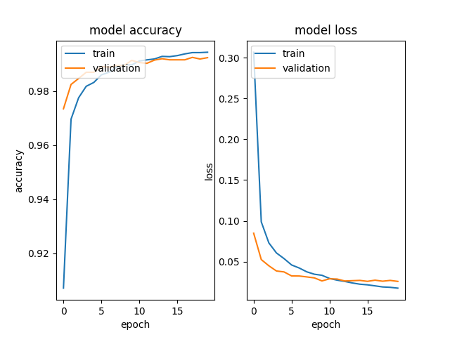

### MNIST-CNN

CNN model trained to classify handwritten digits from the MNIST dataset. MNIST is a dataset of 60,000 28x28 grayscale images of the 10 digits, along with a test set of 10,000 images.

Requirements are,

* Python (2.x if you want t-SNE to be enabled)
* Pathlib
* Numpy
* Matplotlib
* Graphviz (Optional)
* Pydot (Optional)
* t-SNE (Optional)
* Keras
* TensorFlow

Accuracy on testset after 20 epochs is **99.23 %**.

The model visualization is shown in Figure 1.

||
|---|
|Figure 1. Model visualization.|

Accuracy and loss for each epoch is shown in Figure 2.

||
|---|
|Figure 2. Model accuracy and model loss for 20 epochs.|
