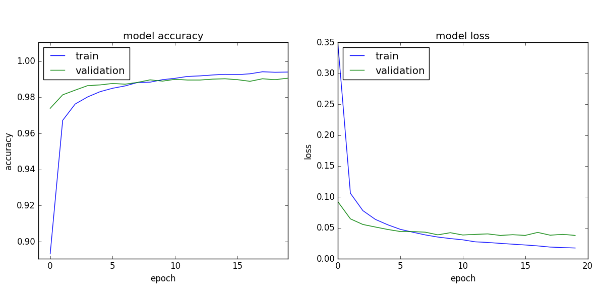

CNN model trained to classify handwritten digits from the MNIST dataset.

MNIST is a dataset of 60,000 28x28 grayscale images of the 10 digits, along with a test set of 10,000 images

Requirements:

* Python 3.x
* Numpy
* Matplotlib
* Keras
* TensorFlow

The first 50,000 images, from the training dataset, are used for training. The last 10,000 images are used for validation.

Accuracy on testset after 20 epochs = 99.16%.

Loss and accuracy for each epoch is shown in figure:

